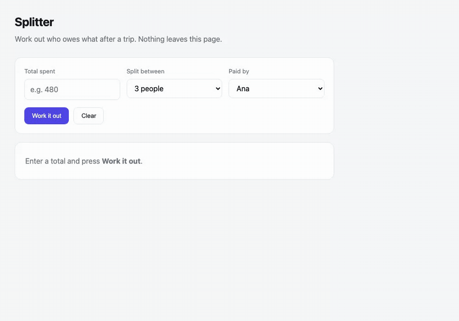

# nolan

**Let your agents show, not just tell.**



*The GIF above is a nolan walkthrough — generated from a spec, filmed against a
real app, narrating its own features. Rebuild it with `npm run example:showcase`.*

Nolan turns a short spec into a narrated walkthrough of your real app — a feature
tour, a bespoke answer to a support question, a look at something an agent just
built and wants to show you. What it *shows* is generated fresh for each person
and moment. How it *looks and speaks* — your colours, your captions, and (soon)
your voice — lives in a separate document your agents reuse and refine. So the
content stays personal while the delivery stays unmistakably yours.

```bash
nolan demo.screenplay.json --cut=hero
```

```
· filming "Splitter — settle up after a trip" — cut: hero (pace 0.65)
· encoding gif → out/splitter-hero.gif
· encoding mp4 → out/splitter-hero.mp4
✓ 12 beats · 9.6s
```

## Why not just record it by hand?

Two reasons. A recording rots the moment the UI moves, so you re-shoot it every
release. And a person can only record so many — you can't hand-film a bespoke
walkthrough for every user, every support question, every POC an agent ships. A
spec an agent writes scales to all of them.

| | hand-recorded | nolan |
|---|---|---|
| Re-shoot after a UI change | record it again | re-run the spec |
| Rebrand every walkthrough at once | re-record each one | edit one style file |
| A bespoke version per person | not happening | an agent writes a new spec |
| It quietly drifts out of date | a user tells you | **CI fails** |

The last two rows are the point: personal at scale, and never stale.

## Try it

Requires Node ≥ 18, `ffmpeg`, and Playwright's Chromium.

```bash
git clone https://github.com/richardofortune/nolan && cd nolan
npm install playwright && npx playwright install chromium
npm start
```

`npm start` opens an interactive menu — pick a demo (the toy app, the
self-describing showcase, a live-site walkthrough, karaoke captions, `verify`,
restyle…) and nolan films it. It checks `ffmpeg` and Playwright are present and
tells you what to install if not.

Prefer to skip the menu? `npm run example` films the bundled toy app in
`examples/site` directly — no other setup, nothing to configure.

## Install it in your own project

```bash
npm i @richfort/nolan
npm i playwright && npx playwright install chromium   # peer dependency
```

Playwright is a **peer dependency**, not a bundled one, so nolan never drags a
browser into a project that only needs the types or the linter. `ffmpeg` has to be
on your `PATH` as well. Miss either and you get a runtime error at filming time,
not an install error — so install both up front.

```js
import { render, verify, DEFAULT_STYLE } from "@richfort/nolan";
```

The `nolan` CLI is on `PATH` too once installed, or run it with `npx nolan`.

## Three documents, three owners

The split is the whole point. What you *show* is generated per person and moment;
how it *looks and speaks* is your brand — held apart so it becomes an asset every
walkthrough inherits.

| | Holds | Who owns it |
|---|---|---|
| **Screenplay** `*.screenplay.json` | WHAT to show — beats, cast, the set | **an agent writes it**, per feature or per recipient |
| **Style + voice** `styles/*.json` | HOW it looks and speaks — captions, presenter, pace, brand colours, output formats *(voice / TTS next)* | your **voice-of-business**, refined over time |
| **Engine** `src/` | drives the browser, films, narrates | nobody |

Because the screenplay is data rather than code, an agent can author a fresh
walkthrough for each person or moment without writing scripts. Because the
voice-of-business lives in one place, every walkthrough any agent makes inherits
it — improve it once, improve them all.

Writing one that *lands* — tone, text, tempo, transitions — is a craft, and it's
the value. [`docs/craft.md`](docs/craft.md) is the guide every screenplay (and
every agent writing one) should follow.

## A screenplay

```json
{
  "title": "Splitter", "slug": "splitter",
  "cuts": { "full": { "pace": 1 }, "hero": { "pace": 0.65 } },
  "cast": { "user": { "kind": "human", "name": "Ana", "bg": "#4f46e5", "ink": "#fff" } },
  "set": {
    "servers": [{ "cmd": "python3", "args": ["-m", "http.server", "8099"], "cwd": "site" }],
    "waitFor": ["http://localhost:8099/index.html"]
  },
  "scenes": [{
    "id": "walkthrough",
    "beats": [
      { "do": "goto",  "url": "http://localhost:8099/index.html" },
      { "do": "actor", "who": "user" },
      { "do": "say",   "text": "Put in what the trip cost." },
      { "do": "click", "to": { "sel": "#total" } },
      { "do": "type",  "text": "480" },
      { "do": "say",   "text": "Then work it out." },
      { "do": "click", "to": { "role": "button", "name": "Work it out" } },
      { "do": "hold",  "ms": 900 }
    ]
  }]
}
```

### Beats

| `do` | Fields | |
|---|---|---|
| `goto` | `url` | navigate |
| `cut` | `url`, `title`, `ms`, `after[]` | curtained scene change |
| `card` | `lines[]`, `ms` | full-screen title card |
| `actor` | `who` | set the persona chip |
| `say` | `text`, `as` | narrate — duration **derived** from length; `as` picks a caption variant |
| `hold` | `ms` | explicit pause (scales with pace) |
| `move` / `click` | `to` | glide the cursor, optionally click |
| `type` | `text`, `delay` | keyboard input |
| `scrollTo` | `to` | centre a target |
| `call` | `fn`, `args[]` | invoke a function on the page |
| `http` | `method`, `url`, `as` | real backend call; bind the response |
| `set` | `name`, `from`, `where` | derive a variable from bound data |
| `js` | `code` | escape hatch |

**Targets:** `{sel}` · `{role, name}` · `{shadow}` / `{shadowText}` (with
`set.shadowHost`) · `{x, y}`. Prefer `role` + `name` — it survives refactors,
which is what keeps a walkthrough usable as documentation.

**Interpolation:** any string takes `{{var.path|filter}}`
(`truncate:n`, `upper`, `plural:one:many`).

### Styled captions

A caption's *look* lives in the style file, never in the screenplay — the same
split as everything else. The style file picks a **preset** (`docs`, `karaoke`,
`highlight`, `minimal`) for the whole film, and defines **variants**: small,
named looks a single line can opt into.

```jsonc
// styles/default.json
"caption": {
  "preset": "docs",
  "backgroundColor": "#16181D", "color": "#F2F3F5", "size": 18,
  "variants": {
    "warn":  { "backgroundColor": "#3A2A0B", "color": "#FFC53D" },
    "aside": { "color": "#9AA0AA", "showChip": false, "italic": true }
  }
}
```

```jsonc
// screenplay — names the intent, not the paint
{ "do": "say", "text": "This deletes the trip. No undo.", "as": "warn" }
```

The screenplay says *this line is a warning*; the style file owns what a warning
looks like — same reason `{role, name}` targets beat `{sel}`. Change the look of
every warning in every demo you own by editing one file.

Fields are flat scalars (`size`, `fontWeight`, `backgroundColor`,
`backgroundOpacity`, …) rather than CSS shorthand, so one axis changes without
touching the rest. The `karaoke` and `highlight` presets light up a word at a
time — and because captions are *authored*, the word timing is derived from
length, with no speech recognition. Old `bg` / `ink` / font-shorthand style
files keep working; they're migrated on load.

**Cuts:** tag any scene or beat with `cuts: ["full"]`. One screenplay, a tight
README hero and a long pitch cut, from a single recording pass.

## Restyle without re-filming

Driving the app is the slow part; the captions are the part you fiddle with.
So `--overlay=post` films the app **clean** and composites the captions on
afterwards, keeping the clean master and a segment manifest next to the outputs:

```bash
nolan demo.screenplay.json --overlay=post
```

Now a new look is a re-encode, not a re-film — no browser, no app, seconds:

```bash
nolan restyle out/splitter-hero.segments.json --style=styles/dark.json
```

The segments are Cap-shaped (`{ id, start, end, text, as, actor }`). Word-level
animation survives compositing: a karaoke or pill-highlight caption is rendered
as a short frame sequence — one still per word-state — and each is overlaid on
its sub-window, so the words light up in post just as they do burned in. (The
per-character typewriter reveal is the one thing still drawn resting in post.)

### Subtitle sidecars

Every render also drops `.srt` and `.vtt` next to the film — the caption text is
authored and its timing is derived, so a subtitle track is just the segment
manifest in another shape. That makes a demo **searchable** and **screen-readable**
instead of pixels-only, for free. WebVTT carries the speaker as a `<v Name>`
voice tag. Choose formats (or opt out) in the style file:

```jsonc
"encode": { "subtitles": ["srt", "vtt"], "outputs": [ /* … */ ] }
```

### A presenter in the corner

Turn on a screen-share-style webcam bubble showing whoever's currently speaking —
off by default, opt in from the style:

```jsonc
// style
"presenter": { "show": true, "corner": "bottom-right", "size": 140, "shape": "circle" }
```

The person is the current **actor**. Give a cast member a `cam` for a real
headshot; without one they get a coloured avatar of their initial:

```jsonc
"cast": { "host": { "kind": "human", "name": "Mia", "bg": "#1A73E8", "cam": "./mia.jpg" } }
```

It's burned in like the cursor, so it works in both burn and post modes, and it
lifts clear of the caption bar automatically. (The rig is Trusted-Types-safe, so
the bubble — and every overlay — renders even on strict sites like Google.)

## Demos that fail CI when they go stale

```bash
nolan verify demo.screenplay.json
```

Resolves every target, films nothing, exits non-zero if the app moved:

```
✗ 2 target(s) no longer resolve:

  [walkthrough] click: no visible element matching "#amount"
  [walkthrough] click: no visible button named "Calculate split"

The app moved under the screenplay. Update the beats, or the demo will lie.
```

Takes a second or two. Put it in CI and your walkthroughs can't quietly start
lying to users.

That's the right default when you **own** the app — a moved target is your bug to
fix. For a walkthrough of a site you *don't* own, a hard failure you can't action
is the wrong call, so `--on-drift` picks the response (same detector, different
who's-responsible):

- `fail` *(default)* — exit non-zero. The CI gate.
- `warn` — report the drift, exit 0. A heads-up, not a blocker.
- `refresh` — re-render if the demo still resolves; only warn if a target truly broke.

## Lint the writing

`verify` checks that the demo still matches the app. `lint` checks that it's any
good:

```bash
nolan lint demo.screenplay.json
```

It reads the screenplay (no browser) and flags the mechanical tells that make a
walkthrough read as AI-written or feel unpolished — em-dashes, forced triads,
clichés, over-long captions, no breathing room, choppy transitions — against the
craft rules in [`docs/craft.md`](docs/craft.md). Errors fail; warnings report;
`--strict` fails on warnings too. The *taste* (warmth, specificity, whether the
arc builds) stays with the author; lint just holds the floor, consistently.

## Point it at your own app

nolan drives a real browser, so it can film anything that renders — but its
sweet spot is **your own product**. Against your app you can whitelist the
automation, log in through `set.initScript`, and skip the captchas that guard
third-party sites. That's where "a walkthrough that regenerates every release"
pays off most: your features, your help centre, your onboarding — filmed against
the real UI, and failing CI the moment it drifts.

You *can* point it at public sites — the examples do (Wikipedia, the Wayback
Machine, Google Calendar, Airbnb). For sites that turn away an unfamiliar
browser, give the screenplay a real identity in `set`:

```jsonc
"set": {
  "userAgent": "Mozilla/5.0 … Chrome/122 …",
  "locale": "en-NZ",
  "initScript": "localStorage.setItem('token', '…')"   // e.g. a test login
}
```

But heavy bot protection — reCAPTCHA, Cloudflare challenges — will block filming,
and that's by design: nolan won't circumvent it. One more reason the best target
is the app you control.

## Timing is derived, on purpose

`say` computes its own duration from the caption length. It is never hardcoded,
so when voiceover lands, duration becomes real audio length and **every
screenplay you already wrote re-times itself** — no re-authoring.

## Status

Early, but it already does a lot: styled captions (variants, presets, karaoke
that animates even in post), post-composited restyling, subtitle sidecars, a
presenter bubble, and a `verify` that fails CI when a demo drifts. It works and
it's in real use — expect rough edges.

**Where it's headed, roughly in order:**
- **Voice.** The "voice" half of the voice-of-business, and the biggest thing
  ahead. Timing already derives from caption length, so when TTS lands —
  narrating in your brand's voice, personalised to the recipient — duration
  becomes real audio length and every walkthrough you already have re-times
  itself, no re-authoring.
- **Authoring + delivery.** An agent that turns a trigger — a feature spec, a
  support ticket, a user record — into a screenplay, renders it, and drops the
  walkthrough where people already are: Slack, email, an embed. The `{{who}}`
  variable is the seed of the personal-at-scale version.

**Rough edges:**
- **No schema validation** — a malformed screenplay fails at the beat, not at load.
- **The `js` escape hatch is arbitrary code.** Treat agent-generated `js` beats
  with the same scrutiny as any generated code; don't accept screenplays from
  people you don't trust.

## Prior art

[VHS](https://github.com/charmbracelet/vhs) does this beautifully for terminal
apps and is the direct inspiration — nolan is the browser-shaped version.
[Pagecast](https://github.com/mcpware/pagecast) records a browser via an AI
agent, aimed at one-off demos with automatic effects; nolan is the opposite
axis — authored, deterministic, re-runnable.

## Licence

MIT
